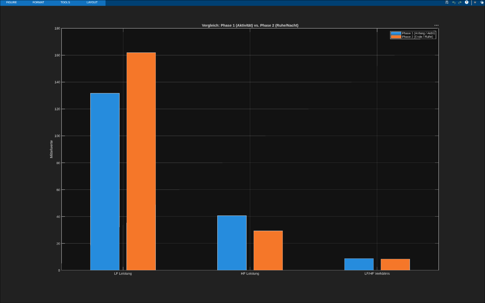
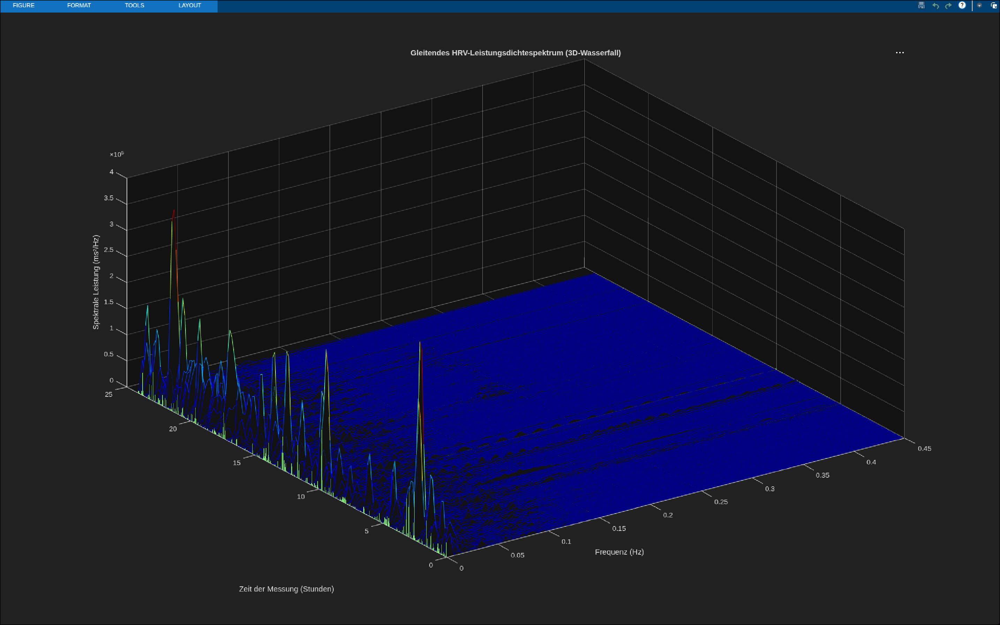
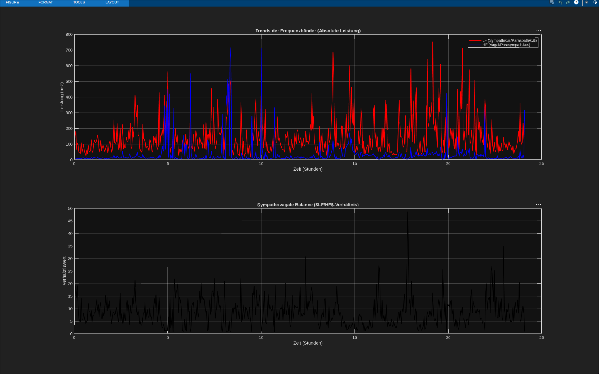
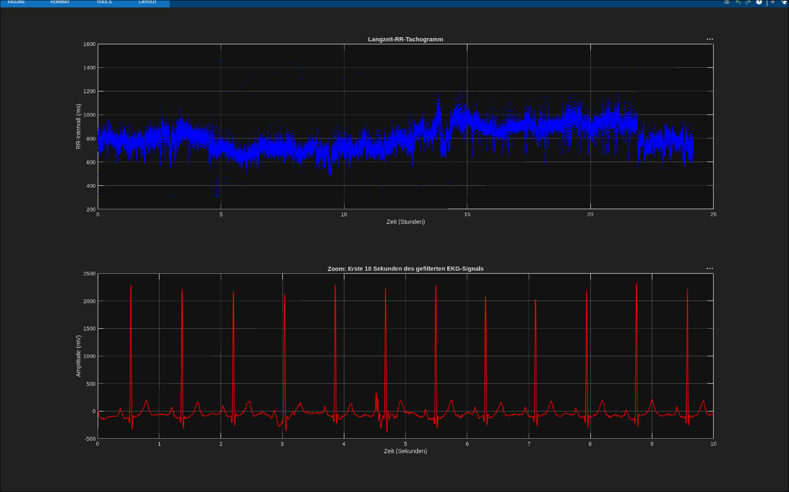

# Matlab Projekt

## quick start
**Note**
a quick start guide is right now not possible.

the installation from the programm and add-ons is not near simple.

## Dependencies

- matlab with dh account

    - Signal Processing Toolbox
    - statistics and Maschine Learning'

## Important files

in root there is the:

- EDF file which to analyze

- Exercise sheet

- a pregenerated programm which to make better

## Infos:

Due: Saturday, 11 July 2026, 11:59 PM

|Nr.| Kriterium | Beschreibung|
|-|-|-|
| 1 | Vortragsstil | Verständliche Sprache, freies Sprechen, Blickkontakt, angemessenes Sprechtempo, sicheres Auftreten |
| 2 | Foliengestaltung | Übersichtliche und ansprechende Gestaltung, sinnvolle Verwendung von Grafiken, gute Lesbarkeit, angemessene Informationsdichte |
| 3 | Roter Faden | Klare Struktur, nachvollziehbarer Aufbau, logische Übergänge zwischen Motivation, Umsetzung und Ergebnissen |
| 4 | Fachliches Niveau | Qualität der entwickelten Lösung, fachlich korrekte Signalverarbeitung, sinnvolle Interpretation der Ergebnisse |
| 5 | Quantitativer Output des Projekts | Umfang der Implementierung, Anzahl realisierter Funktionen, Tiefe der Analysen, Qualität der Visualisierungen und Auswertungen |
| 6 | Code-Qualität | Modularer Aufbau, Lesbarkeit, Kommentare, sinnvolle Variablennamen, Wiederverwendbarkeit, Einhaltung guter Programmierpraktiken |
| 7 | Methodische Umsetzung | Begründete Auswahl von Algorithmen und Parametern (z. B. Filter, FFT, Fensterung, Interpolation), nachvollziehbare Vorgehensweise |
| 8 | Visualisierung und Ergebnisdarstellung | Aussagekräftige Diagramme, Wasserfalldarstellungen, Tabellen und Grafiken; verständliche Interpretation der Ergebnisse |
| 9 | Selbstständigkeit und Problemlösung | Eigenständige Erweiterungen, Umgang mit Schwierigkeiten, kritische Reflexion von Fehlern und Grenzen der Lösung |
| 10 | Beantwortung von Fragen | Fachlich fundierte Antworten, Verständnis der eigenen Implementierung und der verwendeten Verfahren |

## Plots in this moment

