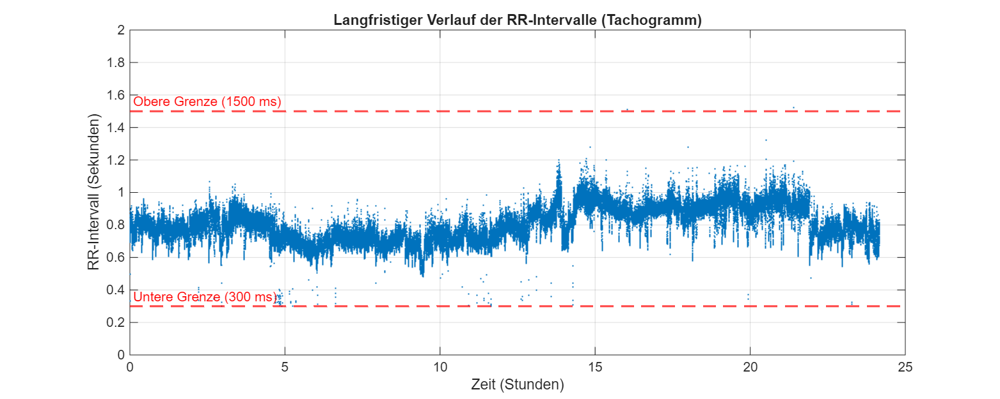
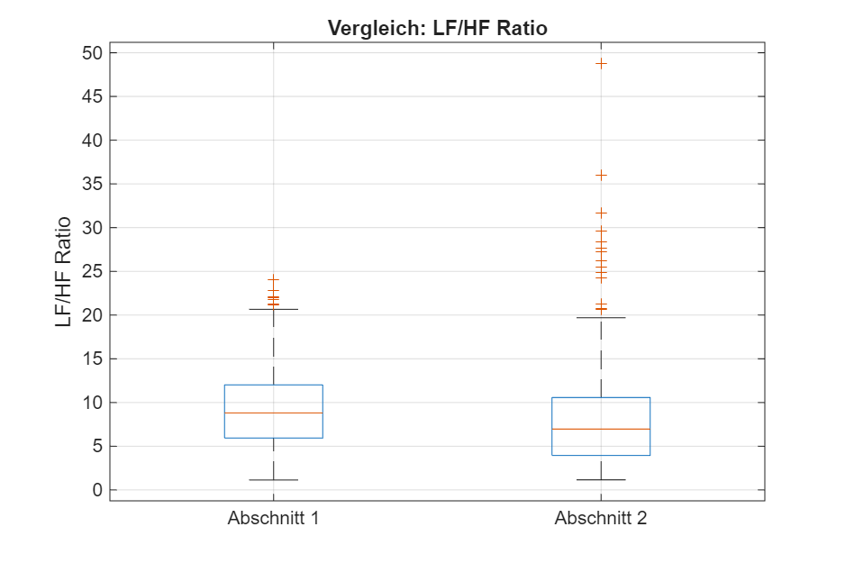
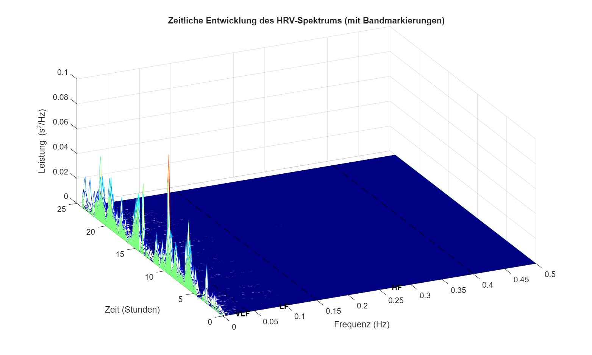
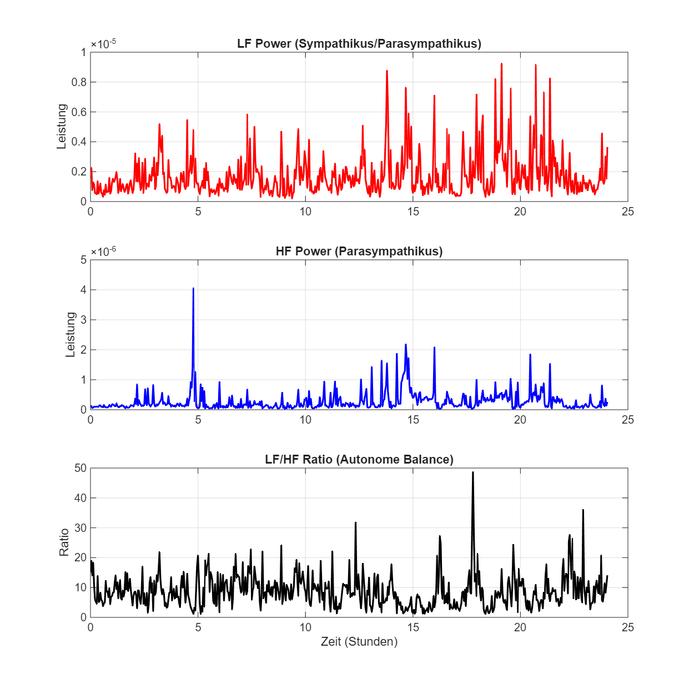
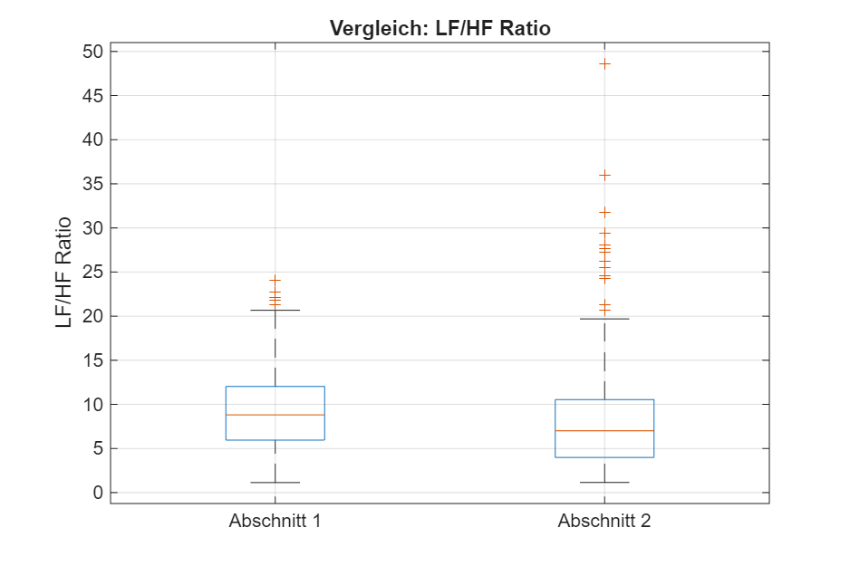
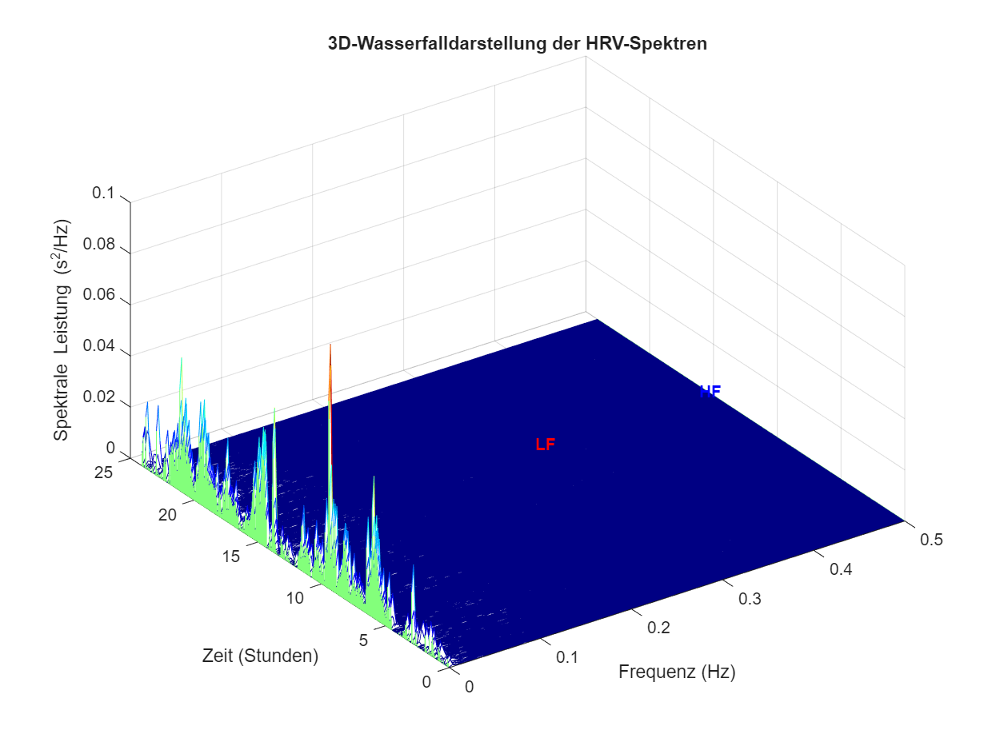

# Visualisierung langfristiger HRV-Änderungen

Dieses MATLAB-Projekt dient der automatisierten Verarbeitung, Analyse und langfristigen Visualisierung von Daten zur Herzratenvariabilität (HRV).

## 1. Voraussetzungen & Add-ons

Für die vollständige Ausführung des Quellcodes wird eine gültige **MATLAB-Lizenz** benötigt. Zudem müssen die folgenden Toolboxen (Add-ons) von MathWorks installiert sein:

* **Signal Processing Toolbox** (MathWorks)
* **Statistics and Machine Learning Toolbox** (MathWorks)

## Structure
- results/ - Stores the generated graphs
- data/ - Stores the EDF files
- src/ - stores the source code

## Last Generated Plots




## 2. Schnellstart

Folgen Sie diesen Schritten, um die Analyse zu starten und die Graphen zu rendern:

1. Installieren Sie MATLAB inklusive der erforderlichen [Add-ons](#1-voraussetzungen--add-ons).
2. Kopieren Sie die gesamte Ordnerstruktur in Ihr aktives MATLAB-Verzeichnis.
3. Platzieren Sie die zu analysierenden Datensätze im Ordner `data/`.
4. Öffnen Sie die Datei `main.m` im Ordner `src/` und führen Sie diese in MATLAB aus.

Die Graphen werden nach der Ausführung automatisch im Interface geöffnet und parallel im Ordner `results/` exportiert.

## 3. Projektstruktur

Das Projekt ist wie folgt strukturiert:

```text
├── data/         # Ablageort der auszuwertenden Eingangsdaten
├── src/          # Speicherort des Quellcodes (Skripte und Funktionen)
│   └── main.m    # Zentrales Hauptskript zur Ausführung der Pipeline
└── results/      # Ausgabeordner für generierte Graphen und Ergebnisse
```

## Generierte Plots




