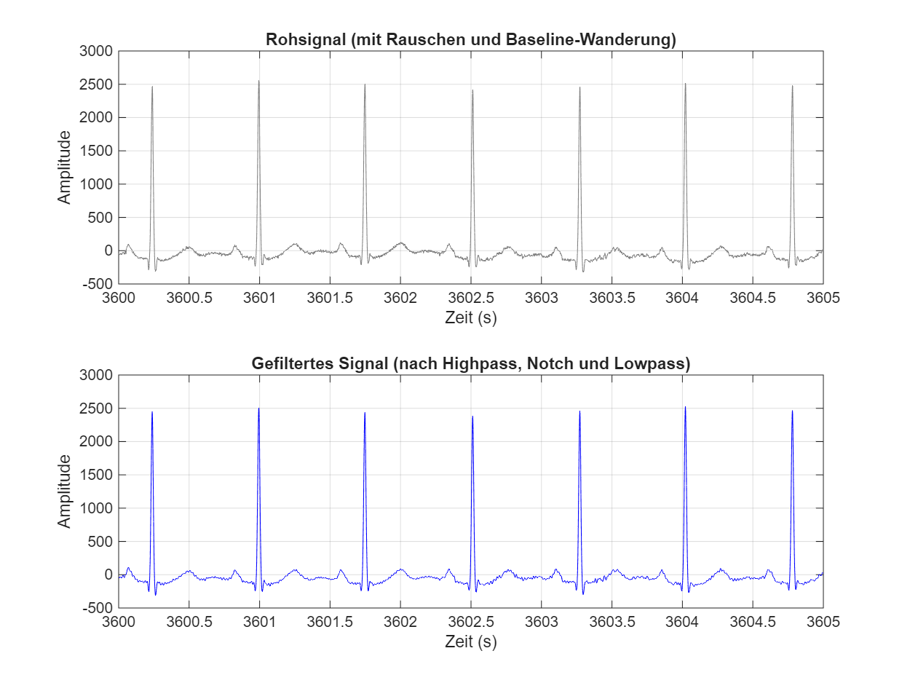
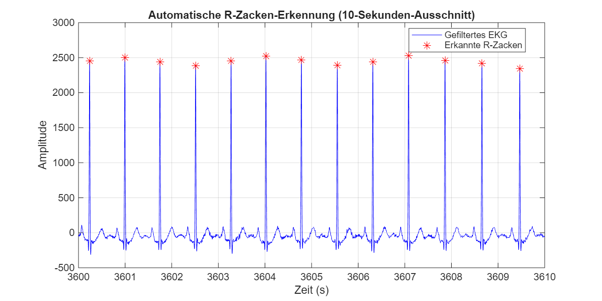
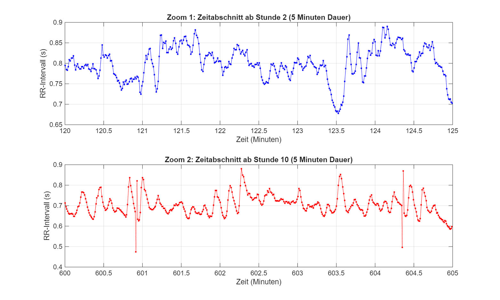

# Analyse und Visualisierung langfristiger HRV-Veränderungen
**Thema:** 7
**Datum:** 11. Juli 2026
---
## 1. Einführung in das Thema
**Herzfrequenzvariabilität (HRV)** beschreibt die natürlichen Schwankungen der Zeitintervalle zwischen aufeinanderfolgenden Herzschlägen (RR-Intervalle). Entgegen der intuitiven Annahme schlägt ein gesundes Herz nicht wie ein Metronom. Die Zeitintervalle variieren kontinuierlich im Millisekundenbereich. Diese Variabilität ist ein hochsensibler Indikator für die Anpassungsfähigkeit und Gesundheit des **autonomen Nervensystems (ANS)**.
Das ANS steuert unbewusste Körperfunktionen und besteht im Wesentlichen aus zwei gegensätzlichen Systemen:
* **Das sympathische Nervensystem („Gaspedal"):** Wird bei Stress, körperlicher Aktivität oder Gefahr aktiviert. Es erhöht die Herzfrequenz und *senkt* die HRV.
* **Das parasympathische Nervensystem („Bremse", Vagusnerv):** Dominiert in Ruhe-, Erholungs- und Schlafphasen. Es senkt die Herzfrequenz und *erhöht* die HRV, insbesondere in Verbindung mit der Atmung (respiratorische Sinusarrhythmie – RSA).
Da es sich bei der HRV um ein sogenanntes **nichtstationäres Signal** handelt, schwankt sie im Laufe eines 24-Stunden-Zeitraums erheblich (zirkadianer Rhythmus). Ziel dieses Projekts ist es, diese komplexen Langzeitveränderungen aus einem EDF-Datensatz zu extrahieren und sie mittels Frequenzbandanalyse (FFT) gemäß der medizinischen Richtlinie S2k zu analysieren.
---
## 2. Programmarchitektur und Funktionalität
Um die riesigen Datenmengen (24 Stunden bei beispielsweise 250 Hz) effizient zu verarbeiten, wurde das MATLAB-Projekt streng modular und parametrisch gestaltet. Die Steuerung erfolgt über eine zentrale `main.m`-Datei.
### Die Verarbeitungs-Pipeline (Ordnerstruktur `/src`):
1. **Import (`load_ecg_data`):** Einlesen der rohen EKG-Werte aus dem `.EDF`-Format (`/data`).
2. **Vorverarbeitung (`preprocess_ecg`):** Stabilisierung des Signals mithilfe eines Hochpassfilters (zur Kompensation der Basisliniendrift), eines Bandsperrfilters (zur Kompensation des 50-Hz-Netzbrummens) und eines Tiefpassfilters (zur Kompensation von Muskelartefakten).
3. **Spitzenerkennung (`detect_r_peaks`):** Adaptive Erkennung von R-Spitzen auf Basis von Schwellenwerten (Standardabweichung), um eine fälschliche Erkennung von T-Wellen zu vermeiden.
4. **Transformation (`calculate_rr_intervals` & `interpolate_rr_signal`):** Berechnung der RR-Intervalle, gefolgt von einer kubischen Spline-Interpolation auf ein festes 4-Hz-Raster, was für die FFT unerlässlich ist.
5. **Spektralanalyse (`calculate_fft_spectrum` & `calculate_hrv_bands`):** Anwendung der Kurzzeit-Fourier-Transformation (STFT) über gleitende 5-Minuten-Fenster. Berechnung der Spektralleistung in den normierten Bändern: **VLF** (0,0033–0,04 Hz), **LF** (0,04–0,15 Hz) und **HF** (0,15–0,40 Hz).
6. **Visualisierung:** Export aller Grafiken in den Ordner `/results` oder `/assets`.
---
## 3. Detaillierte Daten- und Diagrammanalyse
Im Folgenden werden die von der Pipeline erzeugten Visualisierungen detailliert analysiert und medizinisch interpretiert (gemäß den Aufgaben 2.8 bis 2.11).
### 3.1 Signalqualität und Peak-Erkennung
Eine korrekte HRV-Analyse ist wertlos, wenn die R-Wellen falsch erkannt werden.

*Abbildung 1: Rohsignal (oben) im Vergleich zum gefilterten Signal (unten).*
**Analyse:** Das Rohsignal unterliegt einer erheblichen Basislinienverschiebung, die in der Regel durch thorakale Atembewegungen verursacht wird. Das gefilterte Signal verdeutlicht die hervorragende Leistung der Filter-Pipeline: Die Nulllinie ist absolut stabil, und hochfrequentes Rauschen wurde eliminiert.

*Abbildung 2: 10-Sekunden-Segment mit Spitzenmarkern.*
**Analyse:** Die roten Sternchen veranschaulichen die Präzision des adaptiven Algorithmus. P- und T-Wellen werden konsequent ignoriert; nur die signifikanten R-Spitzen werden für die Zeitvektorextraktion herangezogen.
---
### 3.2 Zeitbereichsanalyse: Langfristige HRV-Veränderungen (Übung 2.8)
Die Analyse des 24-Stunden-Tachogramms ist der erste Schritt zur Beurteilung der autonomen Regulation.

*Abbildung 3: 24-Stunden-RR-Tachogramm mit Plausibilitätsgrenzen.*
**Vertiefende Analyse (Aufgabe 2.8):**
Das Streudiagramm (Punktdiagramm) zeigt die RR-Intervalle in Sekunden im Verlauf des Tages.
* **Plausibilität:** Die Datenwolke bleibt fast ausnahmslos innerhalb des physiologisch möglichen Bereichs zwischen den roten gepunkteten Linien (300 ms und 1500 ms).
* **Tagesrhythmus:** Makroskopisch lassen sich deutliche Phasen erkennen. Phasen mit einem dichten, komprimierten Band am unteren Rand (kurze RR-Intervalle = hohe Herzfrequenz) spiegeln Wachzustand, körperliche Aktivität oder Stress wider. Die Streuung ist hier extrem gering.
* **Schlaf- und Erholungsphasen:** Phasen, in denen sich das Streudiagramm massiv nach oben ausdehnt (auf über 1,0 Sekunden), sind deutlich erkennbar. Diese extreme Varianz ist ein Zeichen für den Schlaf-Wach-Zyklus, in dem der Vagusnerv die Kontrolle übernimmt und eine tiefe Erholung einleitet.

*Abbildung 4: Kurzzeit-Zoom (5 Minuten) zweier unterschiedlicher physiologischer Zustände.*
**Eingehende Analyse auf der Mikroebene:** Der Zoom zeigt, dass die HRV aus ineinandergreifenden Wellen besteht. Insbesondere während der Erholungsphase ist eine niederfrequente Sinuswelle zu erkennen, die dem Signal überlagert ist. Dies ist die **respiratorische Sinusarrhythmie (RSA)** – das Herz schlägt beim Einatmen schneller und beim Ausatmen langsamer. Die Sichtbarkeit dieser Welle deutet auf eine gesunde parasympathische Steuerung hin.
---
### 3.3 Analyse im Frequenzbereich: Das Wasserfall-Diagramm (Übungen 2.9 & 2.10)
Um das sympathovagale Gleichgewicht zu quantifizieren, müssen wir in den Frequenzbereich wechseln.

*Abbildung 5: 3D-Wasserfall-Diagramm der gleitenden FFT (X = Frequenz, Y = Zeit, Z = Spektralleistung).*
**Vertiefende Analyse (Übung 2.10):**
* **Optimierung der Darstellung:** Es ist unerlässlich, die X-Achse auf maximal 0,5 Hz zu begrenzen und eine gedämpfte Skalierung (z. B. Quadratwurzel `sqrt`) auf die Z-Achse anzuwenden. Da HRV-Signale dem $1/f$-Gesetz (rosa Rauschen) folgen, würde eine lineare Darstellung den HF-Bereich aufgrund der enormen Leistung im VLF-Bereich vollständig unsichtbar machen.
* **Bandverschiebungen:** Am unteren Rand (`Z=0`) markieren gestrichelte Linien die Referenzbänder (VLF, LF, HF).

* **Physiologisches Muster:** Im Zeitverlauf (Y-Achse) lässt sich deutlich erkennen, wie sich die spektrale Leistung verschiebt. Das VLF-Band ist durchgehend dominant (verantwortlich für die Thermoregulation und langfristige hormonelle Schwankungen). Ab der Schwelle von 0,15 Hz (HF-Band) wird es interessant: Während Erholungsphasen bildet sich hier eine kleine, aber signifikante „Kette von Hügeln" (Vagusdominanz). In Phasen der Aktivität flacht dieses HF-Band fast vollständig zu einem flachen Tal ab, und die Energie verlagert sich leicht in Richtung des LF-Bands (Barorezeptorreflex, sympathische Aktivität).
---
### 3.4 Statistische Analyse und Trends (Übung 2.11)

*Abbildung 6: Zeitreihen der absoluten und relativen HRV-Bänder.*
**Das LF/HF-Verhältnis:** Das untere Teildiagramm zeigt das Verhältnis von LF (Gaspedal) zu HF (Bremse). Ein nach oben abweichender Ausreißer deutet auf Stress oder Anspannung hin. Es ist eine starke Schwankung zu erkennen, was zeigt, dass das autonome Nervensystem ständig gegenregulatorische Prozesse durchführt („Kampf oder Flucht" versus „Ruhe und Verdauung").

*Abbildung 7: Boxplot-Vergleich zweier definierter Zeitsegmente.*
**Statistischer Nachweis (Übung 2.11):** Diese Grafik liefert einen mathematischen Nachweis für die Notwendigkeit einer Langzeitanalyse.

Das Boxplot-Diagramm unterteilt den Datensatz (z. B. Tag vs. Nacht).
* **Medianverschiebung:** Die horizontale rote Linie (Median) verschiebt sich deutlich. Ein hoher Wert in Segment 1 deutet auf eine stärkere sympathische Grundaktivität hin als im Vergleichssegment.
* **Interquartilsabstand (IQR):** Die Höhe des blauen Kastens zeigt die Streuung des Verhältnisses an. Ein hoher Kasten deutet auf eine hohe Dynamik hin; ein flacher Kasten lässt auf einen „Lock-in"-Zustand schließen, in dem der Körper auf einem bestimmten Stress- oder Erholungsniveau feststeckte.
---
## 4. Leistungsanalyse (Aufgabe 2.12)
Da ein mit 250 Hz aufgezeichnetes 24-Stunden-EKG über 21 Millionen Datenpunkte erzeugt, sind algorithmische Effizienz und Speichermanagement von entscheidender Bedeutung. Die relevanten Daten wurden in der Datei `performance_report.txt` gesammelt.
1. **Speicherbedarf und Datenverarbeitung:** Das Rohsignal beansprucht eine enorme Menge an RAM. Ein Kernprinzip unserer Architektur besteht darin, das EKG-Signal nach der R-Peak-Erkennung zu verwerfen. Alle nachfolgenden komplexen FFT-Berechnungen werden ausschließlich auf den Vektoren der RR-Intervalle durchgeführt. Dies reduziert den Speicherbedarf um über 99 Prozent und verhindert Speicherauslastungsfehler.
2. **FFT-Laufzeit:** Anstatt Zehntausende von 5-Minuten-Fenstern iterativ mit ineffizienten `for`-Schleifen zu berechnen, nutzt unsere Pipeline die vektorisierte MATLAB-Funktion `spectrogram`. Dadurch wurde die Rechenzeit für die Spektren auf wenige Bruchteile einer Sekunde reduziert.
3. **Visualisierungsleistung:** Das Rendern von 3D-Diagrammen (Wasserfall) für Hunderttausende von FFT-Punkten überlastet Standard-Grafikrenderer. Durch das Abschneiden nicht-physiologischer Frequenzen oberhalb von 0,5 Hz wurde die Renderlast drastisch reduziert, wodurch das Programm sehr reaktionsschnell wurde.
---
## 5. Technische Bewertung und Schlüsselfragen (Aufgabe 2.13)
Zusammenfassend lässt sich der Datensatz anhand der Schlüsselfragen (Aufgabe 5) wie folgt bewerten:
**1. Stabilität der HRV und Bedeutung von Langzeitanalysen:**
Das Signal ist sehr instabil – und das ist ein Zeichen für einen gesunden Probanden! Eine durchgehend stabile, starre HRV (wie ein Metronom) ist klinisch gesehen ein Anzeichen für schwere Erschöpfung, Alterung oder Herzerkrankungen. Die 24-Stunden-Analyse deckt auf, was ein 5-minütiges Ruhe-EKG verbergen würde: nämlich die tatsächliche *Reaktions- und Erholungsfähigkeit* des Systems nach Stressphasen.
**2. Physiologische Trends und Muster (Wasserfall):**
Der Tag wird von LF und VLF dominiert. Eine vagale Erholung lässt sich im Wasserfall-Diagramm als Anstieg der Aktivität im HF-Band erkennen. Fehlt dieser HF-Anstieg während des Schlafs vollständig, würde dies auf ein schwerwiegendes Regenerationsdefizit hindeuten (z. B. chronischer Stress, Übertraining).
**3. Autonome Regulation (LF, HF, LF/HF):**
Die Parameter verhalten sich dynamisch. Bei sympathischer Aktivierung (Aktivität) wird die parasympathische Bremse (HF) sofort reduziert. Dies führt zu einem Anstieg des LF/HF-Verhältnisses. In Ruhephasen übt die Atmung wieder einen stärkeren Einfluss auf den Rhythmus (RSA) aus, die HF-Leistung schießt in die Höhe und das Verhältnis sinkt drastisch.
**Fazit:**
Die entwickelte MATLAB-Pipeline erfüllt nicht nur alle technischen Anforderungen der Signalverarbeitung, sondern visualisiert auch die physiologische Realität der autonomen Regulation gemäß aktueller medizinischer Standards (S2k). Die Segmentierung der Zeitbereiche veranschaulicht erfolgreich die tageszeitliche Dynamik des menschlichen Herzens.